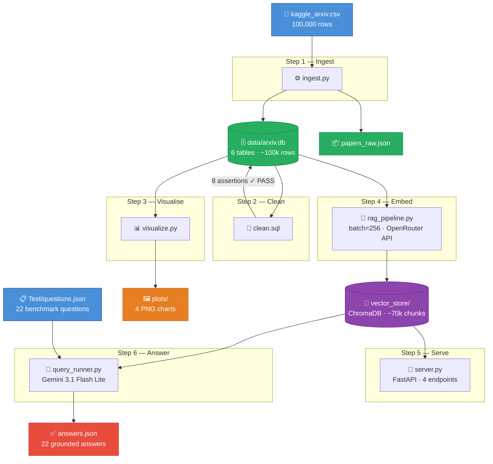

<p align="center">
  <h1 align="center">arXiv Paper Analysis</h1>
  <p align="center">
    A full data product over 100k arXiv papers — ingestion, SQL cleaning, visualisations,<br/>
    semantic RAG retrieval, FastAPI server, and LLM-powered benchmark answers.
  </p>
  <p align="center">
    
    
    
    
    
  </p>
</p>

---

## Data Traversal Flow



| File | Role | Reads | Writes |
|---|---|---|---|
| `ingest.py` | Load & enrich | `data/kaggle_arxiv.csv` | `data/arxiv.db`, `data/papers_raw.json` |
| `clean.sql` | Quality checks | `data/arxiv.db` | `data/arxiv.db` (in-place) |
| `visualize.py` | 4 charts | `data/arxiv.db` | `plots/*.png` |
| `rag_pipeline.py` | Chunk & embed | `data/arxiv.db` | `vector_store/` |
| `server.py` | REST API | `vector_store/`, `data/arxiv.db` | _(responses)_ |
| `query_runner.py` | Batch QA | `vector_store/`, `Test/questions.json` | `answers.json` |

---

## Repository Structure

```
.
├── ingest.py           # Step 1 — load, filter, build all DB tables
├── clean.sql           # Step 2 — SQL quality checks & cleaning
├── visualize.py        # Step 3 — generate all four plots
├── rag_pipeline.py     # Step 4 — embed abstracts, build ChromaDB vector store
├── server.py           # Step 5 — FastAPI RAG server (4 endpoints)
├── query_runner.py     # Step 6 — benchmark answer generation
├── ingest.ipynb        # Cell-by-cell verification notebook
├── answers.json        # Generated answers for all 22 benchmark questions
├── data/               # gitignored — regenerate with ingest.py
├── vector_store/       # gitignored — regenerate with rag_pipeline.py
├── plots/              # 4 publication-ready PNG charts
└── Test/
    └── questions.json  # 22 benchmark questions with grading criteria
```

---

## Requirements

```bash
pip install pandas matplotlib numpy httpx chromadb python-dotenv fastapi uvicorn pydantic
```

Create a `.env` file in the project root:

```
OPENROUTER=sk-or-v1-...
```

Used for embeddings (`sentence-transformers/all-minilm-l6-v2`) and LLM generation (`google/gemini-3.1-flash-lite-preview`) via OpenRouter.

---

## Quick Start

```bash
# 1. Ingest
python ingest.py

# 2. Clean
sqlite3 data/arxiv.db < clean.sql

# 3. Visualise
python visualize.py

# 4. Build vector store (resume-capable)
python rag_pipeline.py

# 5. Start API server
uvicorn server:app --host 0.0.0.0 --port 8000

# 6. Generate benchmark answers
python query_runner.py
```

---

## Step-by-Step Details

### Step 1 — Ingest

`python ingest.py` reads `data/kaggle_arxiv.csv` (100k rows) and builds six tables in `data/arxiv.db`:

| Table | Rows | Description |
|---|---|---|
| `raw_papers` | ~100k | Direct mapping from CSV |
| `papers` | ~100k | Enriched with all derived fields |
| `category_stats` | 5 | Totals & publication rate per category |
| `yearly_trends` | varies | Paper counts per (year, category) |
| `publication_status` | 10 | Published vs Preprint per category |
| `author_stats` | varies | One row per first author |

### Step 2 — Clean

`sqlite3 data/arxiv.db < clean.sql` runs 8 quality checks and prints:

```
check_name                          violations  status
----------------------------------  ----------  ------
papers: null/empty title            0           ✓ PASS
papers: duplicate arxiv_id          0           ✓ PASS
papers: null abstract_word_count    0           ✓ PASS
papers: null author_count           0           ✓ PASS
papers: null/empty first_author     0           ✓ PASS
papers: null submitted_year         0           ✓ PASS
papers: null/empty subject_area     0           ✓ PASS
papers: null/empty pub_status       0           ✓ PASS
```

### Step 3 — Visualise

Four PNGs saved to `plots/`:

| Chart | Description |
|---|---|
| `01_papers_per_category.png` | Bar + dual-axis publication rate line |
| `02_submission_trend_over_time.png` | Multi-line time series + YoY growth |
| `03_publication_status_breakdown.png` | Absolute + 100% normalised stacked bars |
| `04_abstract_length_distribution.png` | Box plots + per-category histograms |

### Step 4 — Build Vector Store

`python rag_pipeline.py` chunks every abstract (200 words / 40 overlap), embeds via OpenRouter in batches of 256, and upserts into ChromaDB.

- **Resume-capable** — auto-detects missing categories, skips already-stored chunks
- **~70k chunks** across all 5 categories on completion

### Step 5 — API Server

```bash
uvicorn server:app --host 0.0.0.0 --port 8000
```

| Method | Endpoint | Description |
|---|---|---|
| `GET` | `/health` | Liveness check |
| `GET` | `/stats` | Paper counts, year range, per-category totals |
| `POST` | `/retrieve` | Semantic chunk retrieval (no LLM) |
| `POST` | `/query` | Full RAG: retrieve + LLM answer |

```bash
curl -X POST http://localhost:8000/query \
  -H "Content-Type: application/json" \
  -d '{"question": "What regularization methods reduce overfitting?", "category_filter": "cs.LG"}'
```

### Step 6 — Benchmark Answers

```bash
python query_runner.py
```

Processes all 22 questions in `Test/questions.json` and writes `answers.json`.
Each entry includes the answer, 5 source citations, model used, and applied filters.

---

## Database Schema

<details>
<summary><strong>Click to expand full schema</strong></summary>

### `papers` *(primary analytics table)*
| Column | Type | Notes |
|---|---|---|
| arxiv_id | TEXT | arXiv paper ID |
| title | TEXT | Paper title |
| abstract | TEXT | Full abstract |
| authors | TEXT | Raw author string |
| primary_category | TEXT | First listed category |
| submitted | TEXT | ISO submission date |
| abstract_word_count | INTEGER | `len(abstract.split())` |
| author_count | INTEGER | Comma-separated author count |
| first_author | TEXT | First token in authors string |
| submitted_year | INTEGER | Year from submitted date |
| subject_area | TEXT | `cs.*` → Computer Science, `stat.*` → Statistics |
| pub_status | TEXT | `Published` if DOI or journal_ref present, else `Preprint` |

### `category_stats`
| Column | Type | Notes |
|---|---|---|
| category | TEXT | primary_category |
| total_papers | INTEGER | Total papers |
| published_count | INTEGER | Papers with pub_status = Published |
| published_rate_pct | REAL | (published / total) × 100 |

### `yearly_trends`
| Column | Type |
|---|---|
| year | INTEGER |
| category | TEXT |
| paper_count | INTEGER |

### `publication_status`
| Column | Type |
|---|---|
| pub_status | TEXT |
| category | TEXT |
| paper_count | INTEGER |

### `author_stats`
| Column | Type | Notes |
|---|---|---|
| author | TEXT | first_author value |
| paper_count | INTEGER | Papers as first author |
| first_year | INTEGER | Earliest year |
| last_year | INTEGER | Latest year |
| top_category | TEXT | Most frequent category |

</details>

---

## Supported Categories

| Category | Field |
|---|---|
| `cs.AI` | Artificial Intelligence |
| `cs.LG` | Machine Learning |
| `cs.CL` | Computation & Language (NLP) |
| `stat.ML` | Statistical Machine Learning |
| `cs.CV` | Computer Vision |
